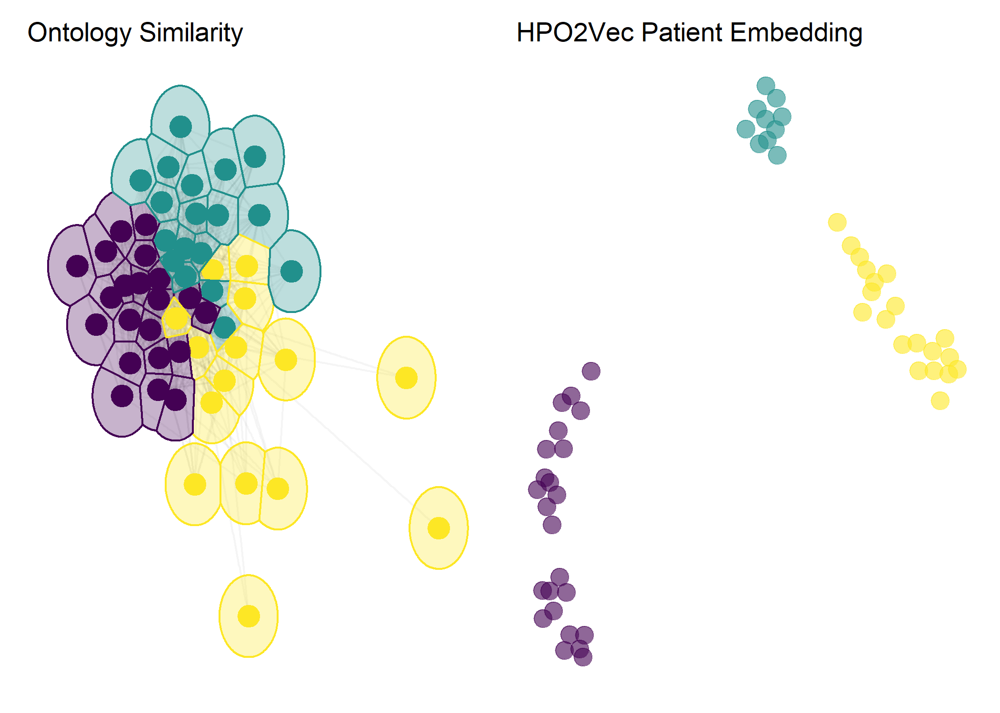

<!-- README.md is generated from README.Rmd. Please edit that file -->

```{r, include = FALSE}
knitr::opts_chunk$set(
  collapse = TRUE,
  comment = "#>",
  out.width = "100%",
  include = FALSE
)
```

# PhenoClustR

<!-- badges: start -->

<!-- badges: end -->

Unsupervised machine learning approaches for patient stratification/clustering by phenotype. 



## Installation

Although this is largely an exploratory project rather than an actual package, one may install the development version of PhenoClustR from this repository:
```{r, eval=FALSE, include=TRUE}
devtools::install_github("Ryan-Laird/PhenoClustR")
```

*Disclaimer:* This is for research purposes only and does not claim to aid diagnostics or medical decision making. If you are working with sensitive data take precaution to protect PII/PHI. Please refer to the [Code of Conduct](CODE_OF_CONDUCT.md) for user/community standards.


## Introduction

This is an experimental package I've developed in an attempt to better stratify a cohort of patients with undifferentiated autoinflammatory disease. It leans heavily on the [Human Phenotype Ontology](https://hpo.jax.org/app/), [`ontologyX`](https://cran.r-project.org/web/packages/ontologyIndex/vignettes/intro-to-ontologyX.html) R package suite, and [HPO2Vec](https://github.com/shenfc/HPO2Vec) (and therefore [Node2Vec](https://github.com/aditya-grover/node2vec)).

Please see [references](references/) for related research. 

The initial findings of this work are to be presented during [NIH Postbac poster day, 2020](https://www.training.nih.gov/postbac_poster_day). My [poster](poster/poster.pdf) is available in this repository and was generated with the wonderful R package [`posterdown`](https://github.com/brentthorne/posterdown). 


## Coming Soon

For the most part this will remain an exploratory project, however I do plan on including additional functionality and resources.

To do's include:

- Create synthetic autoinflammatory phenotype data for reproducible examples

- Provide script for my initial analysis (poster)

- Provide script for generating an enriched HPO node embedding
