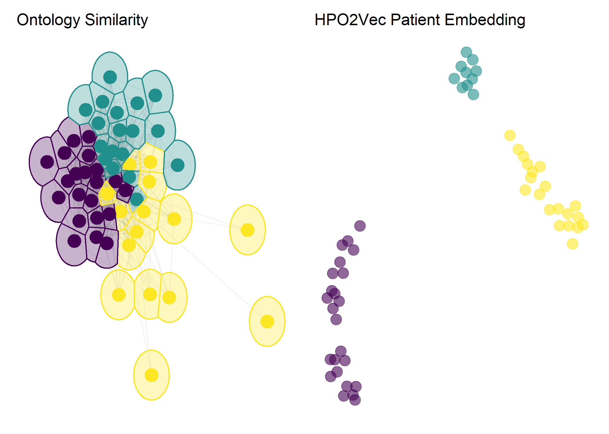

<!-- README.md is generated from README.Rmd. Please edit that file -->

# PhenoClustR

<!-- badges: start -->


<!-- badges: end -->

Unsupervised machine learning approaches for patient
stratification/clustering by phenotype.



## Installation

Although this is largely an exploratory project rather than an actual
package, one may install the development version of PhenoClustR from
this repository:

``` r
devtools::install_github("Ryan-Laird/PhenoClustR")
```

*Disclaimer:* This is for research purposes only and does not claim to
aid diagnostics or medical decision making. If you are working with
sensitive data take precaution to protect PII/PHI. Please refer to the
[Code of Conduct](CODE_OF_CONDUCT.md) for user/community standards.

## Introduction

This is an experimental package I’ve developed in an attempt to better
stratify a cohort of patients with undifferentiated autoinflammatory
disease. It leans heavily on the [Human Phenotype
Ontology](https://hpo.jax.org/app/),
[`ontologyX`](https://cran.r-project.org/web/packages/ontologyIndex/vignettes/intro-to-ontologyX.html)
R package suite, and [HPO2Vec](https://github.com/shenfc/HPO2Vec) (and
therefore [Node2Vec](https://github.com/aditya-grover/node2vec)).

Please see [bibliography](bibliography/) for related research.

The initial findings of this work are to be presented during [NIH
Postbac poster
day, 2020](https://www.training.nih.gov/postbac_poster_day). My
[poster](poster/poster.pdf) is available in this repository and was
generated with the wonderful R package
[`posterdown`](https://github.com/brentthorne/posterdown).

## Coming Soon

For the most part this will remain an exploratory project, however I do
plan on including additional functionality and resources.

To do’s include:

  - Create synthetic autoinflammatory phenotype data for reproducible
    examples

  - Provide script for my initial analysis (poster)

  - Provide script for generating an enriched HPO node embedding
